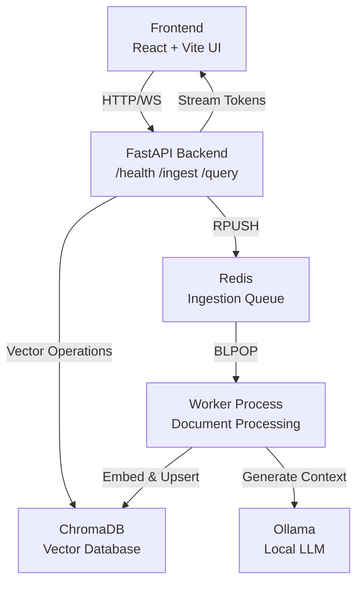
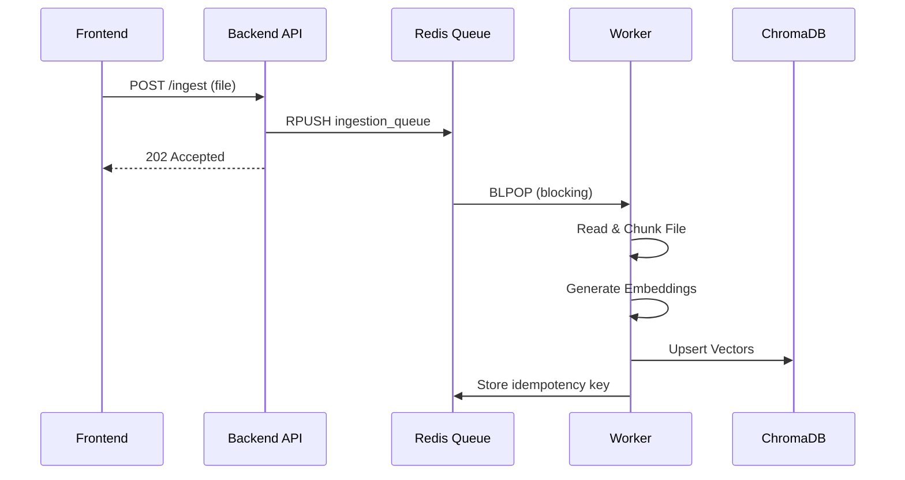
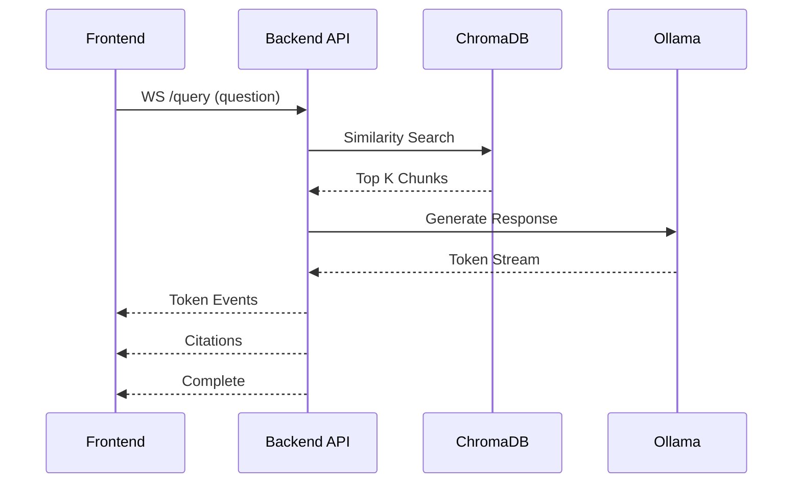
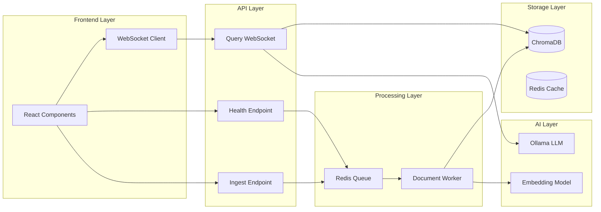

# Architecture

## High-Level System Architecture



## Data Flow

### Ingestion Flow



### Query Flow



## Component Details



## Components

### 1. Frontend
- **Technology**: React + Vite
- **Responsibilities**:
  - Sends file upload requests to `/ingest`
  - Opens WebSocket connection to `/query` for token streaming
  - Renders tokens incrementally and displays citations
  - Real-time UI updates with WebSocket events

### 2. Backend API (FastAPI)
- **Endpoints**:
  - `GET /health`: Service health check and Redis connectivity
  - `POST /ingest`: File validation and task queuing
  - `WS /query`: Context retrieval and token streaming
- **Features**: Async-first design for low latency and high concurrency

### 3. Redis
- **Role**: Durable message queue
- **Keys**:
  - `ingestion_queue`: Redis List for task distribution (RPUSH/BLPOP)
  - `ingestion_dead_letter`: Failed task storage
  - Idempotency keys for duplicate prevention
- **Benefits**: Decouples API from processing, ensures reliability

### 4. Worker
- **Process**:
  1. Blocks on Redis queue (`BLPOP`)
  2. Consumes tasks asynchronously
  3. Processes uploaded files (chunking, embedding)
  4. Stores vectors + metadata in ChromaDB
  5. Implements retry logic with dead-letter queue

### 5. ChromaDB
- **Purpose**: Vector database for embeddings
- **Features**:
  - Persistent collection storage
  - Similarity search at query time
  - Metadata storage alongside vectors

### 6. Ollama
- **Function**: Local LLM for response generation
- **Integration**: Streams model tokens via WebSocket
- **Benefit**: Cost-free development with local inference

## WebSocket Message Contract

All WebSocket messages follow this JSON structure:

```json
{"type":"token","payload":"..."}
{"type":"citation","payload":{"source":"...","chunk_id":0,"similarity":0.9,"sentence":"..."}}
{"type":"error","payload":{"code":"...","message":"..."}}
{"type":"complete","payload":""}
```

## Design Decisions

- **Async-First Backend**: Maximizes throughput and minimizes latency
- **Worker Decoupling**: Prevents blocking on `/ingest` endpoint
- **Local Vector DB**: Simple, reproducible setup with ChromaDB
- **Local LLM**: Cost-effective development using Ollama
- **Message Queue**: Redis provides durable, reliable task distribution
- **Idempotency**: Prevents duplicate processing with Redis keys
